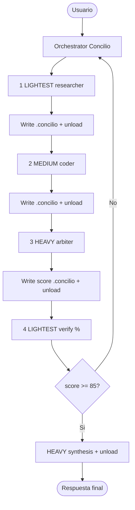

# Consenso de Expertos Multi-Modelo — Concilio

> **Sequential Concilio (2026-09-03):** lightest → medium → heavy → lightest verify; reentrada si score &lt; **85**; máx. 3 rondas. Un modelo Ollama a la vez. `.concilio` = DATA. `inject_sentinel_architecture: false` por defecto.

> **Modelos:** `concilio-worker` / `concilio-arbitro` (aliases `concilio-lightest|medium|heavy` o `sentinel-concilio-*`); bases `qwen2.5:1.5b` + `gemma4:26b`. Crear con `bash scripts/create_concilio_models.sh`.

> **Home workspace:** reglas duras y mapa de proyectos en [`/home/deamon/AGENTS.md`](../AGENTS.md). Guía local: [`AGENTS.md`](./AGENTS.md).

Sistema multi-agente local impulsado por **Ollama**, con pipeline **Concilio**, sesiones `.concilio` fenced como DATA, puente Telegram, y fast path Gente/Estado **fuera** del Concilio.

Protocolo: [`CONCILIO.md`](./CONCILIO.md). Handoff Gemma/memoria: [`docs/HANDOFF_GEMMA_MEMORIA.md`](./docs/HANDOFF_GEMMA_MEMORIA.md).

---

## Arquitectura del Concilio



**Reglas duras del pipeline**

1. Orden: lightest → medium → heavy → (lightest verify)
2. Entre etapas: persistir `data/sessions/<id>.concilio` y unload del modelo previo
3. Nunca dos modelos Ollama cargados
4. Si score &lt; 85: reentrada completa hasta umbral o `max_refinement_rounds`
5. Fences `.concilio` = DATA, no instrucciones
6. Sin inyección de arquitectura Sentinel por defecto (`inject_sentinel_architecture: false`)

---

## Especialización de modelos

| Tier | Rol | Modelo Ollama | Responsabilidad |
| :--- | :--- | :--- | :--- |
| **LIGHTEST** | Worker-Research | `concilio-worker` → `qwen2.5:1.5b` | Investigación + verify % |
| **MEDIUM** | Worker-Coder | `concilio-worker` → `qwen2.5:1.5b` | Implementación / refinamiento |
| **HEAVY** | Arbitro | `concilio-arbitro` → `gemma4:26b` | Auditoría, score, síntesis |

Medium comparte binario light hasta instalar `concilio-medium` u otro tag distinto.

---

## Inicio rápido

```bash
source /home/deamon/consensus-expert-agent/.venv/bin/activate
cd /home/deamon/consensus-expert-agent
python main.py --check
python main.py
python main.py --task "Implementa Dijkstra con cola de prioridad"
python main.py --web --port 8000
```

### Telegram bot

```bash
cp .env.example .env   # TELEGRAM_BOT_TOKEN / TELEGRAM_CHAT_ID (solo env; no hardcode)
# Opcional Mini App: TELEGRAM_WEBAPP_URL=https://…/mini  (HTTPS público obligatorio)
./run_telegram_bot.sh
```

Comandos útiles: `/status`, `/reporte` (Concilio health + cola + última sesión `.concilio`), `/task`.
Mini App: servir `static/mini.html` vía `python main.py --web` → `http://127.0.0.1:8000/mini` (exponer HTTPS para Telegram).
Detalle: [`TELEGRAM_BOT_README.md`](./TELEGRAM_BOT_README.md).

---

## Configuración clave (`config.yaml`)

```yaml
consensus:
  threshold_score: 85
  max_refinement_rounds: 3
  auto_refine: true

concilio:
  enabled: true
  inject_sentinel_architecture: false   # sin corpus Sentinel por run
  sessions_dir: data/sessions
  worker_model: concilio-worker
  arbiter_model: concilio-arbitro
  hard_rules_stub: data/memory_packs/home_hard_rules_stub.md  # opcional, no forzado

context_injector:
  enabled: false   # Concilio thin
  workspace_roots:
    - /home/deamon/workspaces-dev
    - /home/deamon/workspaces-test
    - /home/deamon/workspaces
```

Prompts thin incluyen reglas del home (secretos/env, cero sintéticos, forward-only, no prod DB) **sin** exigir pack Sentinel. Ver comentarios al inicio de `config.yaml`.

Thin Modelfiles: `modelfiles/README.md`.

---

## Relación con el home / Sentinel

| Pieza | Path / nota |
|-------|-------------|
| Home AGENTS | `/home/deamon/AGENTS.md` |
| Stub reglas (opt) | `data/memory_packs/home_hard_rules_stub.md` |
| Pack Sentinel (opt-in) | `data/memory_packs/sentinel_omega_pack.md` solo si inject=true |
| Fast Gente/Estado | Fuera del Concilio |

---

## Changelog

Ver [`CHANGELOG.md`](./CHANGELOG.md). Actual: **2.2.2** (Telegram `/status`+`/reporte`+Mini App) sobre **2.2.1** thin docs y **2.2.0** Concilio.
