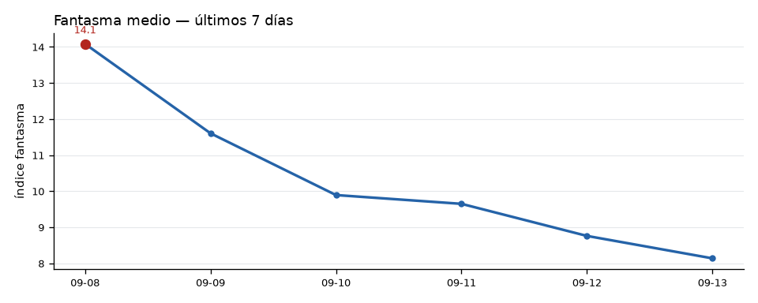

# 🔄 Comparativo diario — 2026-09-13 vs 2026-09-12
*Corte 12:08 hora MX*

| Métrica | Hoy | Ayer | Cambio |
|---|---:|---:|---:|
| Fantasma medio | 8.1 | 8.8 | ▼ -0.6 |
| Fantasma máx | 8.4 | 8.9 | ▼ -0.5 |
| Ciclos corridos | 161 | 102 | ▲ +59 |
| Breaches del Muro | 0 | 0 | ＝ +0 |
| Asertividad viva (resuelta en el día) | — | — | — |
| Patrones cimáticos (total / nuevos 24h) | 190976 | — | +0 |

## ✅ Aciertos — Últimas 24 horas

**No hay predicciones auditadas en este período.**

