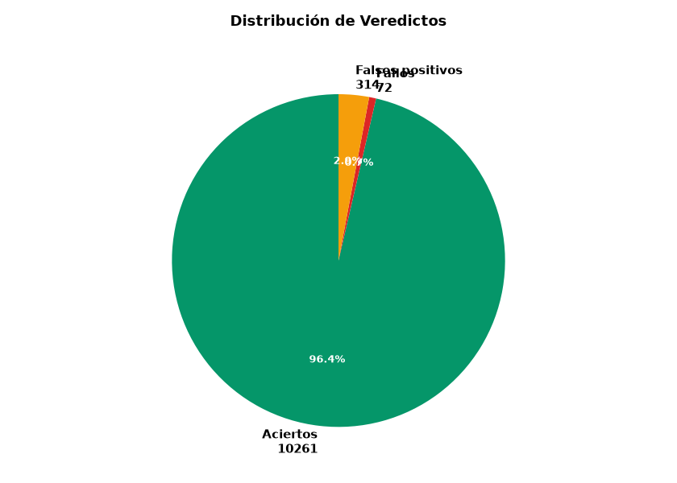
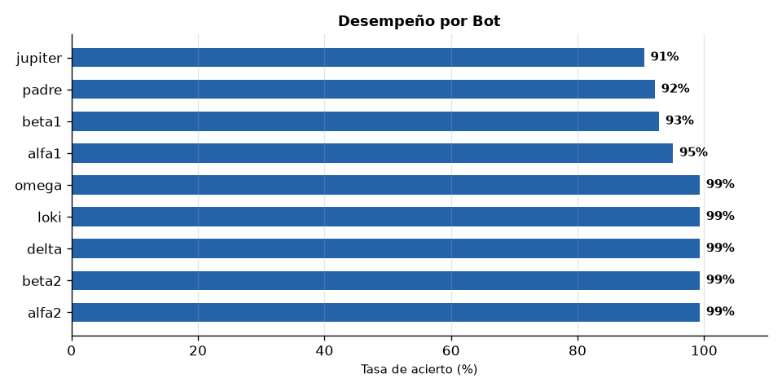
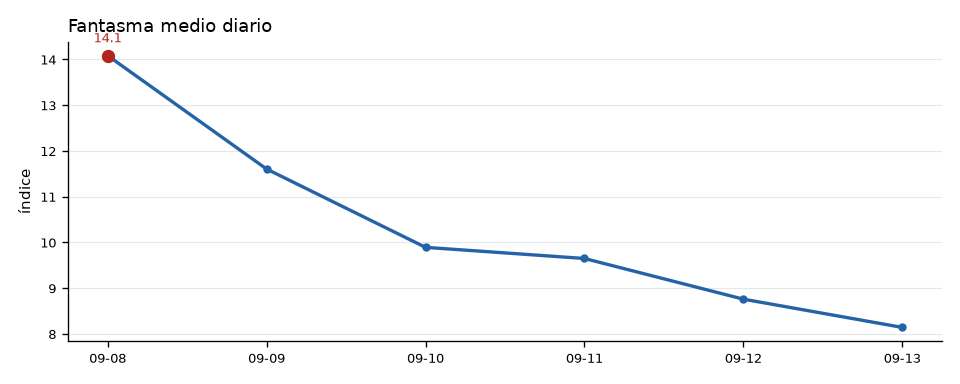
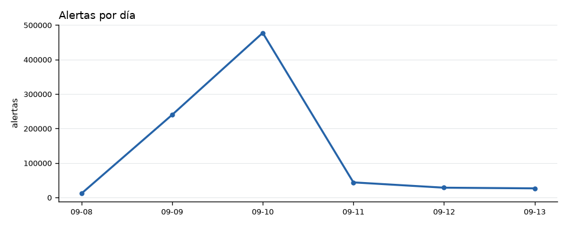
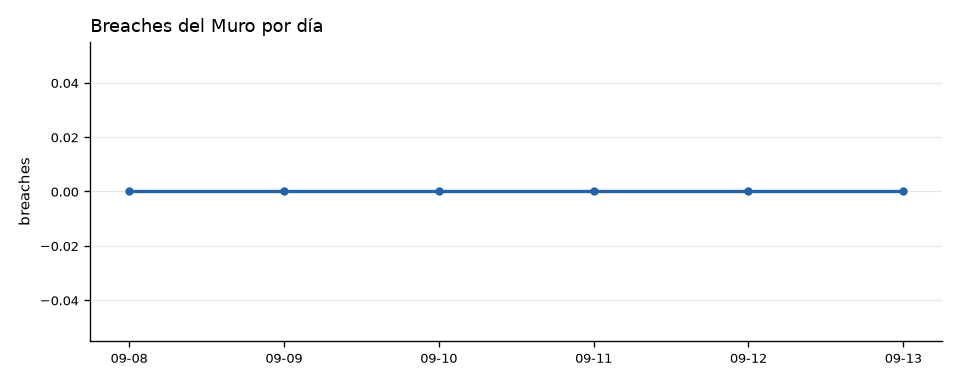

# 📅 Reporte semanal — Sentinel Omega
*Generado 2026-09-13 12:24 hora MX — ventana 7 días*

## Resumen
- Ciclos corridos: **1705**
- Fantasma medio del periodo: **10.4**
- Fantasma máximo: **16.1**
- Breaches del Muro: **0**
- Asertividad viva del periodo: **96%** (n=10647 resueltas)

## Cimática
- Patrones `general`: 76141 (frecuencia máx 435)
- Patrones `nodo`: 114835 (frecuencia máx 435)

| Patrón | Ámbito | Evento asociado | Frecuencia |
|---|---|---|---:|
| 190637 | general | SISMO_M5 | 435 |
| 190638 | nodo 14 | SISMO_M5 | 435 |
| 190639 | nodo 107 | SISMO_M4 | 435 |
| 190640 | nodo 21 | SISMO_M6 | 435 |
| 189470 | general | SISMO_M5 | 264 |
| 189471 | nodo 14 | SISMO_M5 | 264 |
| 189472 | nodo 107 | SISMO_M4 | 264 |
| 189473 | nodo 21 | SISMO_M6 | 264 |
| 190661 | general | SISMO_M5 | 254 |
| 190662 | nodo 14 | SISMO_M5 | 254 |

## ✅ Aciertos — Últimos 7 días

| Métrica | Valor |
|---------|-------|
| **Aciertos** | 10261 |
| **Fallos** | 72 |
| **Falsos positivos** | 314 |
| **Tasa de acierto** | 96.4% `▓▓▓▓▓▓▓▓▓▓▓▓` |
| **Total predicciones** | 10647 |

### 🤖 Desempeño por Bot

| Bot | Aciertos | Tasa | Confianza | Anticipación |
|-----|----------|------|-----------|---------------|
| alfa2 | 1175/1183 | 99% `▓▓▓▓▓▓▓▓` | 0.00 | 0.1d |
| beta2 | 1175/1183 | 99% `▓▓▓▓▓▓▓▓` | 0.20 | 0.1d |
| delta | 1175/1183 | 99% `▓▓▓▓▓▓▓▓` | 0.30 | 0.1d |
| loki | 1175/1183 | 99% `▓▓▓▓▓▓▓▓` | 0.20 | 0.1d |
| omega | 1175/1183 | 99% `▓▓▓▓▓▓▓▓` | 0.40 | 0.1d |
| alfa1 | 1125/1183 | 95% `▓▓▓▓▓▓▓▓` | 0.31 | 0.1d |
| beta1 | 1099/1183 | 93% `▓▓▓▓▓▓▓░` | 0.30 | 0.1d |
| padre | 1091/1183 | 92% `▓▓▓▓▓▓▓░` | 0.19 | 0.1d |
| jupiter | 1071/1183 | 91% `▓▓▓▓▓▓▓░` | 0.22 | 0.1d |

